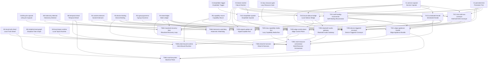

# Muster Pattern Graph

Generated from manifest `subpatterns` relationships.

```mermaid
graph TD
  C1["C1.service-capsule<br/>Service Capsule"]
  C2["C2.persistent-tick<br/>Persistent Tick"]
  C3["C3.dropfolder-trigger<br/>Dropfolder Trigger"]
  C4["C4.lazy-resource-gate<br/>Lazy Resource Gate"]
  C5["C5.failure-ratchet<br/>Failure Ratchet"]
  C6["C6.lifecycle-capsule<br/>Lifecycle Capsule"]
  M1["M1.local-truth-sheaf<br/>Local Truth Sheaf"]
  M2["M2.holonomy-detector<br/>Holonomy Detector"]
  M3["M3.simplicial-task-graph<br/>Simplicial Task Graph"]
  M4["M4.local-topos-runtime<br/>Local Topos Runtime"]
  M5["M5.temporal-sheaf<br/>Temporal Sheaf"]
  R1["R1.socket-anteroom<br/>Socket Anteroom"]
  R2["R2.device-binding<br/>Device Binding"]
  R3["R3.cgroup-governor<br/>Cgroup Governor"]
  R4["R4.state-ledger<br/>State Ledger"]
  R5["R5.capability-mount<br/>Capability Mount"]
  T2C1["T2C1.hot-cold-nas-conveyor<br/>Hot/Cold NAS Conveyor"]
  T2C2["T2C2.dropfolder-spooler<br/>Dropfolder Spooler"]
  T2C3["T2C3.scheduled-herald<br/>Scheduled Herald"]
  T2C4["T2C4.self-healing-reconnector<br/>Self-Healing Reconnector"]
  T2C5["T2C5.local-sidecar-bridge<br/>Local Sidecar Bridge"]
  T2R1["T2R1.bluetooth-audio-gateway<br/>Bluetooth Audio Gateway"]
  T2R2["T2R2.lazy-capability-media-bus<br/>Lazy Capability Media Bus"]
  T2R3["T2R3.edge-control-plane<br/>Edge Control Plane"]
  T2R4["T2R4.device-triggered-conveyor<br/>Device-Triggered Conveyor"]
  T2R5["T2R5.signed-update-rail<br/>Signed Update Rail"]
  T3C1["T3C1.edge-appliance-bundle<br/>Edge Appliance Bundle"]
  T3M1["T3M1.machine-priest<br/>Machine Priest"]
  T3M2["T3M2.ritualized-recovery-loop<br/>Ritualized Recovery Loop"]
  T3M3["T3M3.sheaf-of-services<br/>Sheaf of Services"]
  T3M4["T3M4.holonomic-watchdog<br/>Holonomic Watchdog"]
  T3M5["T3M5.intent-bound-runtime<br/>Intent-Bound Runtime"]
  T3R1["T3R1.multi-resource-orchestrator<br/>Multi-Resource Orchestrator"]
  C1 --> T2C1
  C2 --> T2C1
  C4 --> T2C1
  C5 --> T2C1
  C1 --> T2C2
  C3 --> T2C2
  C5 --> T2C2
  C1 --> T2C3
  C2 --> T2C3
  C5 --> T2C3
  C1 --> T2C4
  C2 --> T2C4
  C5 --> T2C4
  C1 --> T2C5
  C2 --> T2C5
  C5 --> T2C5
  T2C4 --> T2R1
  T2C5 --> T2R1
  R2 --> T2R1
  R4 --> T2R1
  T2C1 --> T2R2
  R1 --> T2R2
  R3 --> T2R2
  R5 --> T2R2
  T2C2 --> T2R3
  T2C3 --> T2R3
  T2C5 --> T2R3
  R1 --> T2R3
  R2 --> T2R3
  R4 --> T2R3
  C1 --> T2R4
  C2 --> T2R4
  C4 --> T2R4
  C5 --> T2R4
  R2 --> T2R4
  R5 --> T2R4
  T2C1 --> T2R4
  T2C3 --> T2R4
  C2 --> T2R5
  C5 --> T2R5
  C6 --> T2R5
  R4 --> T2R5
  T2C1 --> T3C1
  T2C3 --> T3C1
  T2C4 --> T3C1
  T2C5 --> T3C1
  T3C1 --> T3M1
  T3R1 --> T3M1
  M1 --> T3M1
  M5 --> T3M1
  C5 --> T3M2
  T2C4 --> T3M2
  R4 --> T3M2
  M2 --> T3M2
  M5 --> T3M2
  M1 --> T3M3
  M3 --> T3M3
  T2R3 --> T3M3
  T2C3 --> T3M3
  M2 --> T3M4
  T2C3 --> T3M4
  T2C4 --> T3M4
  R4 --> T3M4
  M4 --> T3M5
  M5 --> T3M5
  T2R3 --> T3M5
  R5 --> T3M5
  T3C1 --> T3R1
  T2R1 --> T3R1
  T2R2 --> T3R1
  T2R3 --> T3R1
  R2 --> T3R1
  R4 --> T3R1
```
